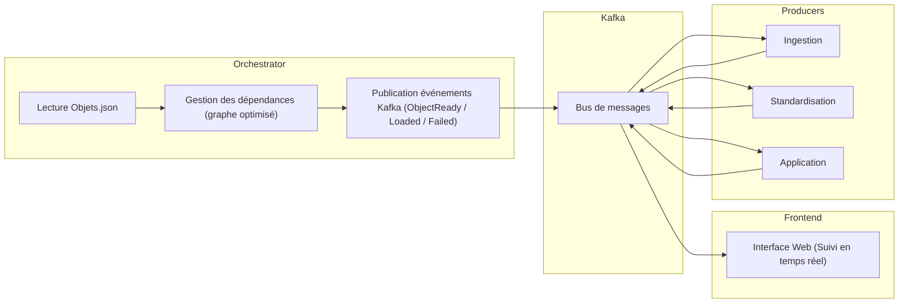

# Orchestrateur de Microservices Kafka

## 📖 Vue d’ensemble

Ce projet met en place un **orchestrateur** (un service de coordination) basé sur **Apache Kafka 📨**. Son rôle est d’organiser et de suivre le traitement d’objets de données décrits dans le fichier **Objets.json 📂**.

---

## 🔧 En pratique

- ⚙️ L’orchestrateur détermine **dans quel ordre** les objets doivent être traités, en respectant leurs dépendances.
- 📨 Il envoie des **messages dans Kafka**, ce qui permet aux différents traitements de s’exécuter **en parallèle** et de manière **asynchrone**.
- 📊 Les objets passent par trois grandes étapes :
  1. **Ingestion 📥**
  2. **Standardisation 🔄**
  3. **Application 🚀**
- 💻 Un **frontend** (interface web) permet de **suivre en direct** l’avancement des traitements.
- 🐳 Le tout est déployé avec **Docker** et **Docker Compose**, ce qui facilite l’installation et l’exécution sur n’importe quelle machine.

---

## 📌 Points clés du projet

- 🎯 Identifier les **objets finaux** (IDs ≥ 3000) et remonter leurs dépendances jusqu’aux **objets sources** (IDs 1000–1999).
- 🧩 Optimiser le **graphe des dépendances** pour éviter de retraiter plusieurs fois les mêmes objets.
- 📨 Publier des **événements Kafka** (*ObjectReady*, *ObjectLoaded*, *ObjectFailed*) pour déclencher et suivre le traitement.
- 👀 Offrir une bonne **visibilité** grâce à des **API 🌐** et un **flux d’événements en temps réel 📡**.

## 📊 Architecture du projet



## 🗂️ Structure du projet

Le projet est organisé comme suit :

⚙️ Orchestrateur (orchestrator/)

Microservice Python (FastAPI).

Charge le fichier Objets.json, construit un graphe de dépendances et publie les événements ObjectReady dans Kafka en respectant l’ordre topologique.

Contient le client Kafka, les modèles Pydantic et la logique d’orchestration.

📨 Producteurs Kafka (producers/) (simulations en Python) :

producer_ingest.py : traite les objets 1000–1999 (⏱️ délai simulé : 0,5s).

producer_standardize.py : traite les objets 2000–2999 (⏱️ délai simulé : 0,6s, avec un échec forcé pour l’ID 2005).

producer_application.py : traite les objets 3000+ (⏱️ délai simulé : 0,8s).

💻 Frontend (frontend/)

Application Angular avec intégration SSE.

Utilise Nginx pour servir et proxy les événements Kafka.

🏗️ Infrastructure

Déployée avec Docker Compose 🐳.

Inclut :

Zookeeper 🦓

Kafka 📨

L’orchestrateur, les producteurs, et le frontend.

📊 Prometheus
•	Rôle : Système de monitoring et métriques.
•	Scrape les métriques exposées par tes producteurs/orchestrateur (ex : via prometheus-client).
•	Accessible sur port 9090 pour voir les métriques brutes. 

📈 Grafana
•	Rôle : Tableaux de bord interactifs.
•	Connecté à Prometheus (et Loki), permet de visualiser les métriques et logs.
•	Accessible sur port 3000 (UI web).

📜 Loki
•	Rôle : Système de gestion de logs, équivalent "Prometheus pour les logs".
•	Collecte les logs envoyés par Promtail et les rend consultables dans Grafana.
•	Exposé sur port 3100.

🕵️ Promtail
•	Rôle : Agent de logs.
•	Lit les fichiers de logs (/var/log) de l’hôte et/ou des conteneurs, et les envoie à Loki.


docker-compose.yml : définit et lance tout le système (frontend + orchestrateur + producteurs).

📦 Dépendances Python

pyproject.toml : gère les dépendances Python via [uv](https://github.com/astral-sh/uv).  


```text
├── frontend
│   ├── src/app
│   │   ├── app.component.html       # Frontend UI template
│   │   ├── app.component.ts         # Angular component logic
│   │   └── event.service.ts         # SSE event handling
│   ├── Dockerfile                   # Docker build for frontend
│   └── nginx.conf                   # Nginx config with SSE proxy
├── grafana                          # Dossier de configuration pour Grafana (visualisation)
│   ├── dashboards
│   │   ├── kafka_events_dashboard.json   # Tableau de bord pour les métriques Kafka (Prometheus)
│   │   └── loki_events_dashboard.json    # Tableau de bord pour les logs (Loki)
│   └── provisioning
│   │   ├── dashboards
│   │   │   └── dashboard.yml        # Configuration des dashboards Grafana
│   │   └── datasources
│   │       └── datasource.yml       # Configuration des sources de données (Prometheus & Loki)
├── orchestrator                     # Microservice Orchestrateur
│   ├── app.py                       # FastAPI orchestrator
│   ├── kafka_client.py              # Kafka producer/consumer logic
│   ├── models.py                    # Pydantic event models
│   ├── orchestrator.py              # Dependency graph and orchestration logic
│   └── utils.py                     # Utility for loading JSON
├── producers                        # Microservices Producteurs
│   ├── producer_ingest.py           # Ingestion simulator
│   ├── producer_standardize.py      # Standardization simulator
│   └── producer_application.py      # Application simulator
├── prometheus                       # Dossier de configuration pour Prometheus (collecte des métriques)
│   └── prometheus.yml               # Configuration de Prometheus (jobs de scraping)
├── docker-compose.yml               # Orchestrates all services
├── Dockerfile                       # Orchestrator Docker build
├── Objets.json                      # Input data with object configurations
├── promtail-config.yaml             # Configuration de Promtail (pour l'envoi des logs vers Loki)
├── pyproject.toml                   # Python dependencies managed with uv
```

---
# Observabilité : Métriques et Logs
Ce projet est instrumenté avec une pile d'observabilité complète, permettant de surveiller les performances et de diagnostiquer les problèmes en temps réel.

Prometheus : Un système de surveillance et d'alerte. Il collecte les métriques (comme le nombre total d'événements publiés) en interrogeant périodiquement les services instrumentés.

Promtail : Un agent de log qui envoie les logs des conteneurs à Loki. Il est configuré pour lire les logs de chaque service.

Loki : Un système de stockage de logs. Il agrège et indexe les logs envoyés par Promtail, ce qui permet de les rechercher efficacement.

Grafana : Une plateforme de visualisation. Il se connecte à Prometheus (pour les métriques) et à Loki (pour les logs) pour afficher des tableaux de bord unifiés.

Flux Observé : Rôles et Responsabilités
Ce document décrit le flux de traitement des objets dans le système, les rôles de chaque composant et les événements Kafka échangés.

1. Orchestrateur : Publication de ObjectReady pour 1001
Qui : L'orchestrateur
Implémentation : orchestrator/orchestrator.py et orchestrator/app.py

Quoi :

Charge Objets.json et construit un graphe de dépendances avec NetworkX.

Identifie l'objet 1001 comme source (sans dépendance, IdObjet_Parent = null).

Effectue un tri topologique pour déterminer l'ordre de traitement.

Publie un événement Kafka ObjectReady pour l'objet 1001 sur le topic object.events via KafkaClient (kafka_client.py).

Pourquoi :
1001 est le premier nœud dans l'ordre topologique, car il n'a pas de dépendances.

2. Producteur d'ingestion : Traitement de 1001
Qui : Producteur d'ingestion
Implémentation : producers/producer_ingest.py

Quoi :

Consomme les événements du topic object.events via AIOKafkaConsumer.

Vérifie si l'événement est ObjectReady et si id_objet (1001) est dans sa plage (1000-1999).

Simule le traitement de l'objet 1001 (asyncio.sleep(0.5)).

Publie un événement ObjectLoaded pour 1001 sur le topic object.events via AIOKafkaProducer.

Pourquoi :
Ce producteur gère les objets sources (1000-1999) et simule le travail d'ingestion (extraction de données brutes).

3. Orchestrateur : Publication de ObjectReady pour 2002
Qui : L'orchestrateur

Quoi :

Suit l'ordre topologique du graphe.

Identifie que 2002 est prêt à être traité (ses dépendances, comme 1001, sont résolues).

Publie ObjectReady pour 2002 sur le topic object.events.

Pourquoi :
L'ordre topologique garantit que les dépendances de 2002 sont traitées avant.

4. Producteur de standardisation : Traitement de 2002
Qui : Producteur de standardisation
Implémentation : producers/producer_standardize.py

Quoi :

Consomme les événements du topic object.events.

Vérifie si l'événement est ObjectReady et si id_objet (2002) est dans sa plage (2000-2999).

Simule le traitement de standardisation (asyncio.sleep(0.6)).

Publie ObjectLoaded pour 2002.

Pourquoi :
Gère la transformation des objets intermédiaires (2000-2999).

5. Publication et traitement parallèle pour 3005 et 3006
Qui :

Orchestrateur : publication des ObjectReady

Producteur d'application : traitement des objets

Quoi :

Orchestrateur :

Publie ObjectReady pour 3005 et 3006 (dépendances résolues).

Producteur d'application (producers/producer_application.py) :

Consomme ObjectReady.

Vérifie que les objets (3005, 3006) sont dans sa plage (3000+).

Simule le traitement (asyncio.sleep(0.8) par objet).

Publie ObjectLoaded.

Peut traiter plusieurs objets en parallèle grâce à la consommation asynchrone Kafka.

Pourquoi :
Ces objets sont terminaux (couche application), Kafka permet un traitement parallèle.

6. Gestion des échecs (exemple 2005)
Qui : Producteur de standardisation

Quoi :

Simule un échec forcé sur 2005.

Publie ObjectFailed sur le topic object.events avec métadonnées d'erreur ("error": "test forcé de objectfailed").

Pourquoi :
Tester la gestion des erreurs et la journalisation dans le système.

---

## 7. Résumé des Rôles

| Composant | Rôle principal | Plage d'objets | Temps de traitement |
|-----------|----------------|----------------|------------------|
| Orchestrateur | Publie `ObjectReady` en ordre topologique | Tous | - |
| Producteur d'ingestion | Traite les objets sources | 1000-1999 | 0.5s |
| Producteur de standardisation | Traite objets intermédiaires | 2000-2999 | 0.6s |
| Producteur d'application | Traite objets terminaux | 3000+ | 0.8s |
| Frontend | Affiche événements Kafka en temps réel via SSE | - | - |
| Kafka | Communication entre producteurs et orchestrateur | - | - |

---

## 8. Endpoints API de l'orchestrateur

- `/orchestrate` : déclenche le processus d'orchestration  
- `/events/last` : récupère le dernier événement  
- `/events/stream` : stream SSE des événements en temps réel  

---

## 9. Architecture Kafka

- Tous les échanges d'événements se font via Kafka (`object.events`)  
- Permet un traitement asynchrone et parallèle des objets

---

## 🚀 Lancer le projet

### Prérequis
Docker et Docker Compose
Python 3.11 (pour le développement local, même si Docker gère le runtime)
Node.js 20 (pour la compilation du frontend, pris en charge par Docker)

### Étapes

#### Cloner le dépôt
```bash
git clone <url-du-repo>
cd kafka-orchestrator
```
#### Construire et lancer avec Docker Compose
```bash
docker compose up --build
```
#### Services démarrés
🦓 Zookeeper : port 2181

📨 Kafka : port 9092

⚙️ Orchestrateur : port 8000

🔄 Producteurs : ingest, standardize, application

📊 Prometheus : port 9090 (collecte les métriques)

📝 Promtail : envoie les logs à Loki

🔍 Loki : port 3100 (stocke les logs)

📈 Grafana : port 3000 (visualise les métriques et les logs)

💻 Frontend : port 4200 (visualisation en temps réel des événements)
