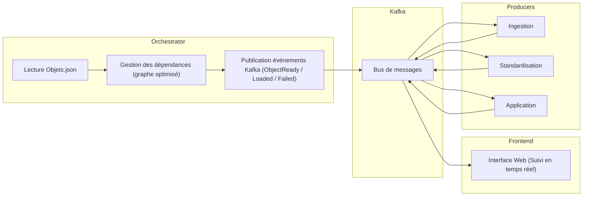

# Kafka Orchestrator Microservice

# 📖 Vue d’ensemble

Ce projet met en place un **orchestrateur** (un service de coordination) basé sur **Apache Kafka 📨**.  
Son rôle est d’organiser et de suivre le traitement d’objets de données décrits dans le fichier **Objets.json 📂**.

---

## 🔧 En pratique

- ⚙️ L’orchestrateur détermine **dans quel ordre** les objets doivent être traités, en respectant leurs dépendances.  
- 📨 Il envoie des **messages dans Kafka**, ce qui permet aux différents traitements de s’exécuter **en parallèle** et de manière **asynchrone**.  
- 📊 Les objets passent par trois grandes étapes :  
  1. **Ingestion 📥**  
  2. **Standardisation 🔄**  
  3. **Application 🚀**  
- 💻 Un **frontend** (interface web) permet de **suivre en direct** l’avancement des traitements.  
- 🐳 Le tout est déployé avec **Docker** et **Docker Compose**, ce qui facilite l’installation et l’exécution sur n’importe quelle machine.  

---

## 📌 Points clés du projet

- 🎯 Identifier les **objets finaux** (IDs ≥ 3000) et remonter leurs dépendances jusqu’aux **objets sources** (IDs 1000–1999).  
- 🧩 Optimiser le **graphe des dépendances** pour éviter de retraiter plusieurs fois les mêmes objets.  
- 📨 Publier des **événements Kafka** (*ObjectReady*, *ObjectLoaded*, *ObjectFailed*) pour déclencher et suivre le traitement.  
- 👀 Offrir une bonne **visibilité** grâce à des **API 🌐** et un **flux d’événements en temps réel 📡**.  

## 📊 Architecture du projet




## 🗂️ Structure du projet

Le projet est organisé comme suit :  

- **⚙️ Orchestrateur (`orchestrator/`)**  
  - Microservice **Python (FastAPI)**.  
  - Charge le fichier **`Objets.json`**, construit un **graphe de dépendances** et publie les événements **`ObjectReady`** dans **Kafka** en respectant l’ordre topologique.  
  - Contient le **client Kafka**, les **modèles Pydantic** et la logique d’orchestration.  

- **📨 Producteurs Kafka (`producers/`)** (simulations en Python) :  
  - **`producer_ingest.py`** : traite les objets **1000–1999** (⏱️ délai simulé : 0,5s).  
  - **`producer_standardize.py`** : traite les objets **2000–2999** (⏱️ délai simulé : 0,6s, avec un échec forcé pour l’ID **2005**).  
  - **`producer_application.py`** : traite les objets **3000+** (⏱️ délai simulé : 0,8s).  

- **💻 Frontend (`frontend/`)**  
  - Application **Angular** avec intégration **SSE**.  
  - Utilise **Nginx** pour servir et proxy les événements Kafka.  

- **🏗️ Infrastructure**  
  - Déployée avec **Docker Compose 🐳**.  
  - Inclut :  
    - **Zookeeper** 🦓  
    - **Kafka** 📨  
    - **Kafdrop** (interface web de Kafka)  
    - L’**orchestrateur**, les **producteurs**, et le **frontend**.  
  - **`docker-compose.yml`** : définit et lance tout le système (frontend + orchestrateur + producteurs).  

- **📦 Dépendances Python**  
  - **`pyproject.toml`** : gère les dépendances Python via [uv](https://github.com/astral-sh/uv).  


```text
├── frontend
│   ├── src/app
│   │   ├── app.component.html    # Frontend UI template
│   │   ├── app.component.ts      # Angular component logic
│   │   └── event.service.ts      # SSE event handling
│   ├── Dockerfile                # Docker build for frontend
│   └── nginx.conf                # Nginx config with SSE proxy
├── orchestrator
│   ├── app.py                    # FastAPI orchestrator
│   ├── kafka_client.py           # Kafka producer/consumer logic
│   ├── models.py                 # Pydantic event models
│   ├── orchestrator.py           # Dependency graph and orchestration logic
│   └── utils.py                  # Utility for loading JSON
├── producers
│   ├── producer_ingest.py        # Ingestion simulator
│   ├── producer_standardize.py   # Standardization simulator
│   ├── producer_application.py   # Application simulator
├── docker-compose.yml            # Orchestrates all services
├── Dockerfile                    # Orchestrator Docker build
├── Objets.json                   # Input data with object configurations
└── pyproject.toml                # Python dependencies managed with uv
```

---


## 🚀 Lancer le projet

### Prérequis
Docker et Docker Compose
Python 3.11 (pour le développement local, même si Docker gère le runtime)
Node.js 20 (pour la compilation du frontend, pris en charge par Docker)

### Étapes

#### Cloner le dépôt
```bash
git clone <url-du-repo>
cd kafka-orchestrator
```
#### Construire et lancer avec Docker Compose
```bash
docker compose up --build
```
#### Services démarrés

🦓 Zookeeper : port 2181

📨 Kafka : port 9092

⚙️ Orchestrateur : port 8000

🔄 Producteurs : ingest, standardize, application

📊 Kafdrop : port 9000 (interface web de monitoring Kafka)

💻 Frontend : port 4200 (visualisation en temps réel des événements)
